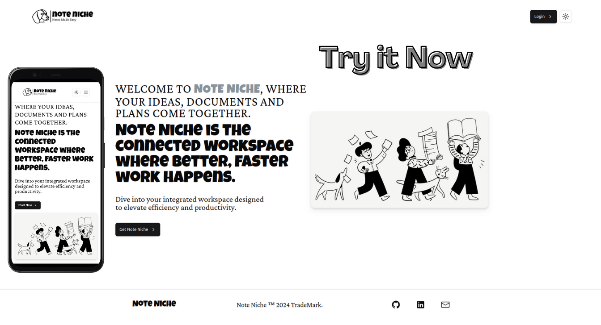

# Note Niche

Note Niche is a Notion clone for creating and sharing notes. It's a powerful, flexible, and user-friendly platform for managing your notes, ideas, and documents. 
<div align="center">
  <br />
      
  <br />
</div>

<div align="center">
   
  
  
  
  
  
</div>


## Features

- Create, edit, and share notes
- Organize your notes in a structured way
- Collaborate with others on shared notes
- User authentication and management
- Dark and light themes

## Technologies Used

- [Next.js](https://nextjs.org/) - The React Framework
- [TypeScript](https://www.typescriptlang.org/) - Typed JavaScript
- [Node.js](https://nodejs.org/en/) - JavaScript runtime
- [MongoDB](https://www.mongodb.com/) - Document database
- [Clerk](https://clerk.dev/) - User authentication and management
- [Zustand](https://github.com/pmndrs/zustand) - State management
- [Tailwind CSS](https://tailwindcss.com/) - Utility-first CSS framework
- [EdgeStore](https://edgestore.dev/) - Edge data storage

## Getting Started

These instructions will get you a copy of the project up and running on your local machine for development and testing purposes.

### Prerequisites

- Node.js
- MongoDB

### Installation

1. Clone the repo:

```bash
git clone https://github.com/Mlika-Gaith/notion-clone.git
   ```

2. Install NPM packages

```bash
npm install
   ```

3. Config your env variables see .env.example


```bash
NEXT_PUBLIC_CLERK_PUBLISHABLE_KEY=
CLERK_SECRET_KEY=
MONGODB_URI=
EDGE_STORE_ACCESS_KEY=
EDGE_STORE_SECRET_KEY=
```

4. Start the dev server

```bash
npm run dev
```

5. App should be available at [http://localhost:3000/](http://localhost:3000/)